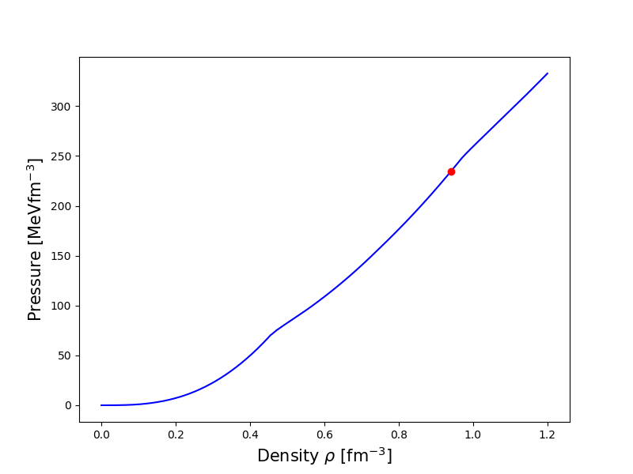
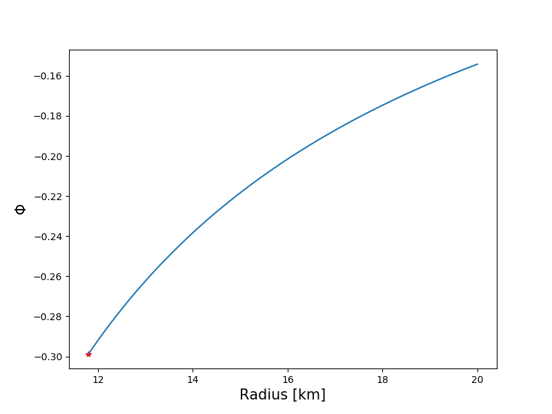

# PYTOV: Tolman-Oppenheimer-Volkoff equation solver

PYTOV is a simple Python Tolman-Oppenheimer-Volkoff (TOV) equation integrator.

---

The program PYTOV integrates the following set of four equations ($G = c = 1$):
$$
\frac{dM}{dr} =4\pi r^{2} \epsilon (r)
$$
$$
\frac{d\Phi}{dr} = \frac{  ( M(r) + 4\pi r^{3} P(r))}{r^{2}(1 - \frac{2 M(r)}{r})}
$$
$$
\frac{dP}{dr} = - (\epsilon (r) + P(r)\frac{d\Phi}{dr}
$$
$$
\frac{dA}{dr} = \frac{4\pi r^{2}\rho}{\sqrt{1 - 2 M(r)/r}}
$$
These equations include the TOV equations [1,2] supplemented with an equation for the total number of baryons in the compact star. The dependent variables are $M$ the gravitational mass, $\Phi$ the gravitational potential, $P$ the pressure and $A$ the total number of baryons.

This repository contains:
- A data file (**bps.dat**) containing the low density equation of state known as BPS [3].
- A data file (**beta_eos.dat**) containing a high density equation of state obtained from a Hartree-Fock calculation of the Quark-Meson Coupling (QMC) model, specifically the *Standard* variation appearing in [5-7].

- The python script PYTOV.py which integrates the above mentioned equations. The following is a brief summary of what the code does:

    +   A high density equation of state file and a low density equation of state file will be read and then combined in a simple manner.

    +   Simple logarithmic interpolation of the combined equation of state is used [4].

    +   A simple fixed step fourth order Runge-Kutta method is used to integrate the TOV equations. A central density is specified and the TOV equations are integrated out to the surface of the compact star. This is repeated for a range of densities.

    -   The required data for a mass vs radius curve is output to a file (**compact_stars.dat**) along with a file containing the details of the maximum mass compact star (**max_mass_star.dat**). Running PYTOV will also produce the following figures:
    - a mass vs radius figure
      

    - pressure vs density figure
      

    - and a gravitational field vs radius figure
      

# References
1. J. R. Oppenheimer and G. M. Volkoff, G. M., "On Massive Neutron Cores". [Physical Review. 55 (4): 374–381 (1939)](https://journals.aps.org/pr/abstract/10.1103/PhysRev.55.374)
2. R. C. Tolman, "Static Solutions of Einstein's Field Equations for Spheres of Fluid". [Physical Review. 55 (4): 364–373 (1939)](https://journals.aps.org/pr/abstract/10.1103/PhysRev.55.364).

3. G. Baym, C. Pethick and P. Sutherland, The ground state of matter at high densities: Equation of state and stellar models, [Astrophysical Journal, vol. 170, p.299 (1971)](http://adsbit.harvard.edu/cgi-bin/nph-iarticle_query?1971ApJ...170..299B&defaultprint=YES&filetype=.pdf)

4. W. D. Arnett and R. L. Bowers, A microscopic interpretation of neutron star structure, [Astrophysical Journal Supplement, vol. 33, p.415 (1977)](http://articles.adsabs.harvard.edu/cgi-bin/nph-iarticle_query?1977ApJS...33..415A&amp;data_type=PDF_HIGH&amp;whole_paper=YES&amp;type=PRINTER&amp;filetype=.pdf)

5. [D. L. Whittenbury, PhD thesis](https://inspirehep.net/record/1495499/files/02whole.pdf) Hadrons and Quarks in Dense Matter: From Nuclear Matter to Neutron Stars, University of Adelaide.

6. D. L. Whittenbury, J. D. Carroll, A. W. Thomas, K. Tsushima, and J. R. Stone, Quark-meson coupling model, nuclear matter constraints, and neutron star properties. [Phys. Rev. C 89, 065801 (2014)](https://journals.aps.org/prc/abstract/10.1103/PhysRevC.89.065801)

7.  D. L. Whittenbury, H. H. Matevosyan, and A. W. Thomas, Hybrid stars using the quark-meson coupling and proper-time Nambu–Jona-Lasinio models. [Phys. Rev. C 93, 035807 (2016)](https://journals.aps.org/prc/abstract/10.1103/PhysRevC.93.035807)
