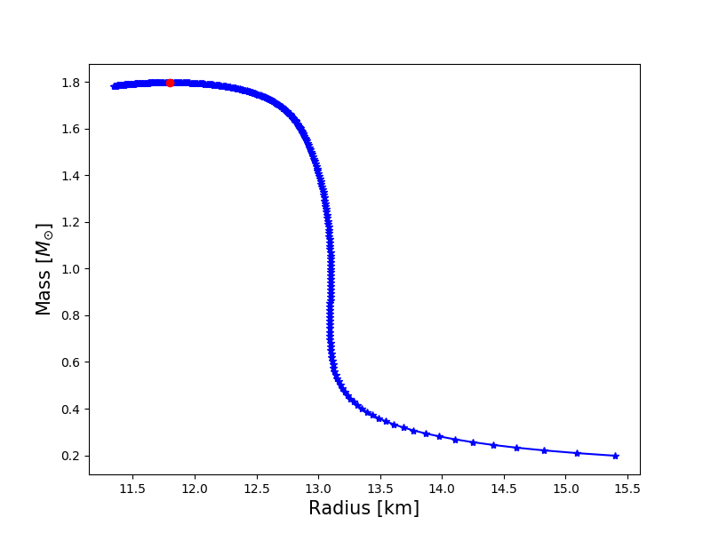

# PYTOV: Python Tolman-Oppenheimer-Volkoff equation solver
---

PYTOV is a simple Python implementation to integrate the Tolman-Oppenheimer-Volkoff (TOV) equations.

---

The program PYTOV integrates the following set of four equations ():

These equations include the TOV equations [1,2] supplemented with an equation for the total number of baryons in the compact star. The dependent variables are the gravitational mass, the gravitational potential, the pressure and the total number of baryons.

This repository contains:
- A data file (**bps.dat**) containing the low density equation of state known as BPS [3].
- A data file (**beta_eos.dat**) containing a high density equation of state obtained from a Hartree-Fock calculation of the Quark-Meson Coupling (QMC) model, specifically the *Standard* variation appearing in [5-7].

- The python script **PYTOV.py** which integrates the above mentioned equations. The following is a brief summary of what the code does:

    +   A high density equation of state file and a low density equation of state file will be read and then combined in a simple manner.

    +   Simple logarithmic interpolation of the combined equation of state is used [4].

    +   A simple fixed step fourth order Runge-Kutta method is used to integrate the TOV equations. A central density is specified and the TOV equations are integrated out to the surface of the compact star. This is repeated for a range of densities.

    -   The required data for a mass vs radius curve is output to a file (**compact_stars.dat**) along with a file containing the details of the maximum mass compact star (**max_mass_star.dat**). Running PYTOV will also produce the following figures:
    - a mass vs radius figure
      

    - pressure vs density figure
      

    - and a gravitational field vs radius figure
      

# References
1. J. R. Oppenheimer and G. M. Volkoff, G. M., "On Massive Neutron Cores". [Physical Review. 55 (4): 374–381 (1939)](https://journals.aps.org/pr/abstract/10.1103/PhysRev.55.374)
2. R. C. Tolman, "Static Solutions of Einstein's Field Equations for Spheres of Fluid". [Physical Review. 55 (4): 364–373 (1939)](https://journals.aps.org/pr/abstract/10.1103/PhysRev.55.364).

3. G. Baym, C. Pethick and P. Sutherland, The ground state of matter at high densities: Equation of state and stellar models, [Astrophysical Journal, vol. 170, p.299 (1971)](http://adsbit.harvard.edu/cgi-bin/nph-iarticle_query?1971ApJ...170..299B&defaultprint=YES&filetype=.pdf)

4. W. D. Arnett and R. L. Bowers, A microscopic interpretation of neutron star structure, [Astrophysical Journal Supplement, vol. 33, p.415 (1977)](http://articles.adsabs.harvard.edu/cgi-bin/nph-iarticle_query?1977ApJS...33..415A&amp;data_type=PDF_HIGH&amp;whole_paper=YES&amp;type=PRINTER&amp;filetype=.pdf)

5. [D. L. Whittenbury, PhD thesis](https://inspirehep.net/record/1495499/files/02whole.pdf) Hadrons and Quarks in Dense Matter: From Nuclear Matter to Neutron Stars, University of Adelaide.

6. D. L. Whittenbury, J. D. Carroll, A. W. Thomas, K. Tsushima, and J. R. Stone, Quark-meson coupling model, nuclear matter constraints, and neutron star properties. [Phys. Rev. C 89, 065801 (2014)](https://journals.aps.org/prc/abstract/10.1103/PhysRevC.89.065801)

7.  D. L. Whittenbury, H. H. Matevosyan, and A. W. Thomas, Hybrid stars using the quark-meson coupling and proper-time Nambu–Jona-Lasinio models. [Phys. Rev. C 93, 035807 (2016)](https://journals.aps.org/prc/abstract/10.1103/PhysRevC.93.035807)
